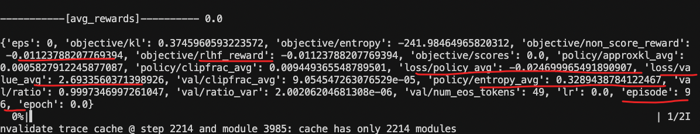
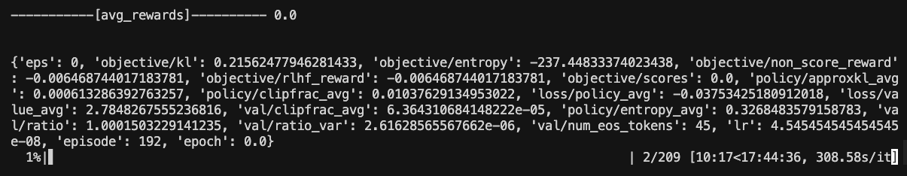

## 奖励模型评估结果
- 由于是直接 RL，并没有 SFT，所以模型预测不出来

- response_length 设为 1300 直接爆显存，改为 512就可以正常运行了
- 总共需要训练 17个小时







### 指令：
```
accelerate launch \
	--num_processes 6 \
	--num_machines 1 \
	--machine_rank 0 \
    --config_file ./configs/deepspeed_zero3.yaml \
	--deepspeed_multinode_launcher standard RL_stage2.py \
    --model_name_or_path /root/autodl-tmp/models/Qwen2.5-1.5B-Instruct \
    --reward_model_path /root/autodl-tmp/models/medical_o1_verifier_3B \
    --value_model_path /root/autodl-tmp/models/Qwen2.5-1.5B-Instruct \
    --dataset_name  /root/autodl-tmp/HuatuoGPT-o1/data/medical-o1-verifiable-problem/medical_o1_verifiable_problem.json \
    --response_length 512 \
    --temperature 0.5 \
    --local_rollout_forward_batch_size 6 \
    --num_ppo_epochs 3 \
    --num_mini_batches 1 \
    --total_episodes 20000 \
    --per_device_train_batch_size 1 \
    --gradient_accumulation_steps 16 \
    --bf16 True \
    --output_dir ./ckpts \
    --save_strategy steps \
    --save_step 20 \
    --save_total_limit 1 \
    --eval_strategy steps \
    --eval_steps 20 \
    --kl_coef 0.03 \
    --learning_rate 5e-7 \
    --warmup_ratio 0.05 \
    --gradient_checkpointing True \
    --dataloader_num_workers 4 \
    --run_name ppo_medical_o1_8B \
    --num_sample_generations -1 \
    --report_to wandb

```